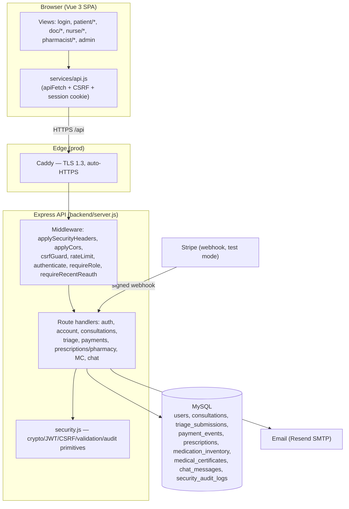
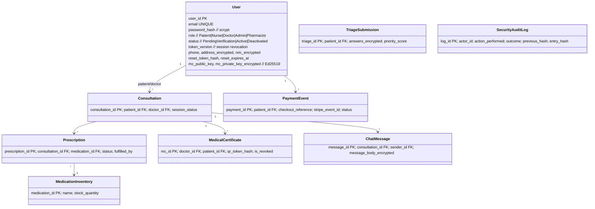
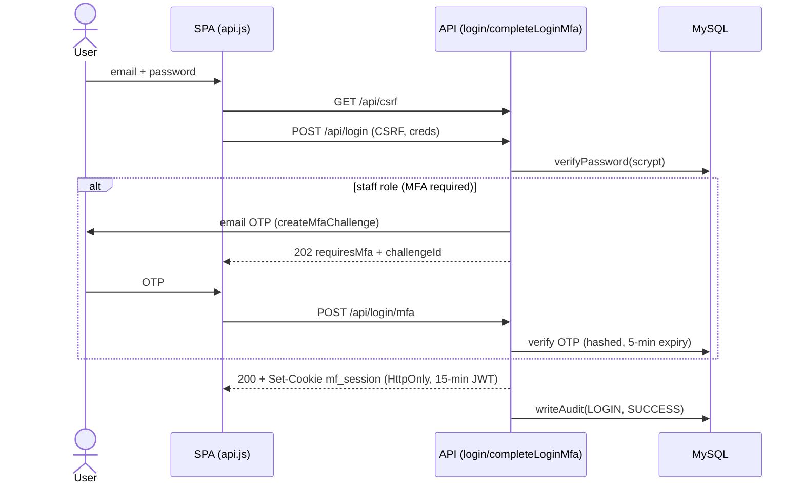
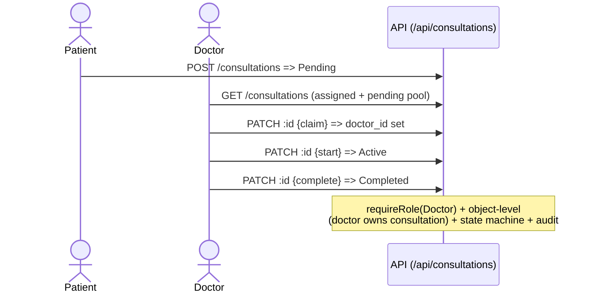
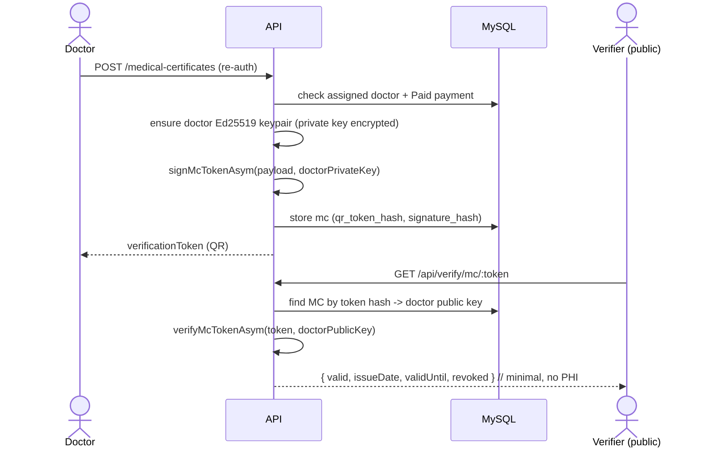
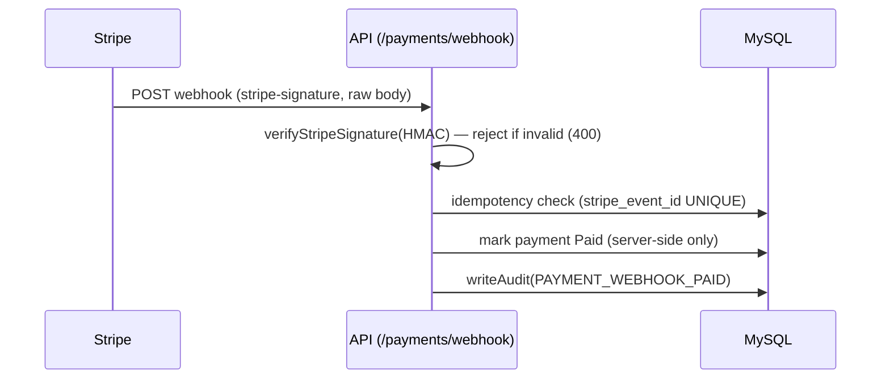

# MediFlow — UML / Architecture Diagrams (Report II)

Mermaid diagrams (render natively on GitHub). They document code structure and the key
secure flows. Each maps to handlers in `backend/server.js` and primitives in
`backend/security.js`.

## 1. Component / package diagram



## 2. Domain / data model (class-style)



## 3. Sequence — Login with MFA



## 4. Sequence — Consultation booking lifecycle (Phase 2)



## 5. Sequence — MC issuance + public verification (Ed25519, Phase 6)



## 6. Sequence — Pharmacy fulfilment (transactional, Phase 3)

```mermaid
sequenceDiagram
  actor Ph as Pharmacist
  participant BE as API (/prescriptions/:id/fulfil)
  participant DB as MySQL
  Ph->>BE: POST fulfil (re-auth)
  BE->>DB: BEGIN; SELECT prescription FOR UPDATE
  BE->>DB: UPDATE inventory SET stock=stock-1 WHERE stock>0
  alt affectedRows = 0
    BE->>DB: ROLLBACK
    BE-->>Ph: 409 out of stock (oversell prevented)
  else
    BE->>DB: UPDATE prescription status=Fulfilled; COMMIT
    BE-->>Ph: 200 fulfilled
  end
```

## 7. Sequence — Secure Stripe payment webhook


